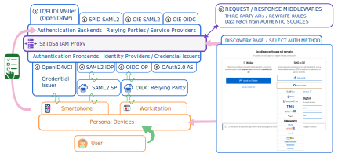
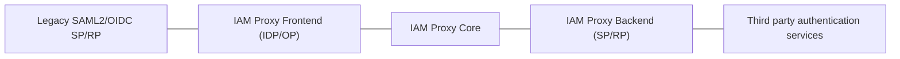

# IAM Proxy Italia

An **IAM (Identity and Access Management) proxy** is an intermediary that connects identity providers (IdPs) and service providers (SPs) using different protocols. It solves the problem of **interoperability**: legacy or heterogeneous systems (SAML2, OIDC, eID Wallet) cannot communicate directly because they speak different protocols. The proxy translates between them, adapts metadata, and routes requests, so that SPs and RPs do not need to be rewritten to support each identity system.

IAM Proxy Italia is the distribution of the [SATOSA](https://github.com/IdentityPython/SATOSA) IAM Proxy allowing
**SAML-to-SAML**, **OIDC-to-SAML**, **OIDC-to-OIDC**, **SAML-to-Wallet** and **OIDC-to-Wallet** interoperability
with the  **Italian Digital Identity Systems**.

## Table of Contents

1. [Use Cases](#use-cases)
2. [General Architecture of the Solution](#general-architecture-of-the-solution)
3. [Demo Components](#demo-components)
4. [Usage, Setup and Documentation](#usage-setup-and-documentation)
5. [Authors and Contributors](#authors-and-contributors)

## Use Cases

IAM Proxy Italia supports these main use cases.

### Legacy System implementing new protocols

Legacy SAML2 Service Providers or OIDC RPs authenticate users via:

- SPID, CIE, and eIDAS Identity Providers (metadata and authentication flows adaptation)
- EUDIW Wallet Instance (OpenID4VP)
- IT-Wallet Instance (OpenID4VP)

### Digital Credential Issuance

Users requesting Digital Credentials from Credential Issuers (OpenID4VCI) can be authenticated through:

- Legacy SAML2/OIDC infrastructure (SPID, CIE, eIDAS)
- Credential Presentations (OpenID4VP)

### Credential Issuer using Authentic Sources

Credential Issuers can fetch and enrich credential data from authentic sources using **microservices**: the proxy intercepts requests/responses and calls third-party or local systems to retrieve, validate, or augment attributes before issuing credentials.

**Figure1**: *The IAM Proxy Italia acts as a centralized intermediary, providing protocol translation and metadata adaptation between legacy SAML2/OIDC Service Providers and various authentication systems including SPID, CIE, eIDAS Identity Providers, and eID Wallet authentication systems based on OpenID4VP.*

## General Architecture of the Solution

The proxy sits between **Service Providers** (SPs) and **Relying Parties** (RPs) on one side, and **Identity Providers** (IdPs) and authentication systems on the other.

 It translates protocols, adapts metadata, and routes requests so that a single SP/RP can support multiple identity systems (SPID, CIE, eIDAS, EUDI Wallet) without protocol-specific code.

### Core Components

| Component | Role | Protocols |
|-----------|------|-----------|
| **Frontend** | Exposes the proxy as an IdP/OP to SPs and RPs. SPs and RPs talk to the proxy; the frontend implements SAML2 IdP, OIDC OP, and/or OpenID4VCI Credential Issuer. | SAML2, OIDC, OpenID4VP, OpenID4VCI |
| **Backend** | Connects the proxy to upstream IdPs and authentication systems. Implements SAML2 SP, OIDC RP, or Wallet RP and talks to SPID, CIE, eIDAS, EUDI Wallet, etc. | SAML2, OIDC, OpenID4VP |
| **Microservices** | Plugins that intercept HTTP requests and responses to apply rules, enrich data from authentic sources, or route traffic. For example, **TargetRouting** picks the right backend based on the IdP chosen by the user. | — |
| **Discovery Service** | Web interface where users choose which authentication method to use (SPID, CIE, Wallet, etc.), which determines which backend handles the flow. | — |

### Supported Backends and Frontends

Available **backends** (SP/RP side; connect to IdPs) and **frontends** (IdP/OP side; connect to SPs/RPs):

### Available Backends

- SAML2 SPID SP
- SAML2 CIE id SP
- SAML2 FICEP SP (eIDAS 1.0)
- SAML2 SP (Satosa native)
- CIE OIDC
- EUDI Wallet (eIDAS 2.0, experimental) OpenID4VP via [eudi-wallet-it-python](https://github.com/italia/eudi-wallet-it-python)

### Available Frontends

- SAML2 IDP (Satosa native)
- OIDC OP via [satosa-oidcop](https://github.com/UniversitaDellaCalabria/SATOSA-oidcop)
- OpenID4VCI via [eudi-wallet-it-python](https://github.com/italia/eudi-wallet-it-python)

## Demo Components

IAM Proxy Italia includes a set of demo components to exercise the features.

User may run them via [Docker Compose](docs/docker-compose.md); use [profiles](docs/docker_compose_profiles.md) to select services. Components live in `iam-proxy-italia-project-demo-examples` and are wired in [Docker-compose/docker-compose.yml](Docker-compose/docker-compose.yml):

| Component                | Path                                         | Docker service         | Profiles                                        | Exercises                                |
| ------------------------ | -------------------------------------------- | ---------------------- | ----------------------------------------------- | ---------------------------------------- |
| **Django SAML2 SP**      | `djangosaml2_sp/`                            | `django_sp`            | demo, dev, saml2                                | SAML2 frontend, SPID/CIE/Wallet backends |
| **Federation authority** | `spid_cie_oidc_django/federation_authority/` | `trust-anchor`         | demo, storage_mongo, oidc                       | OpenID Federation 1.0 Trust Anchor / X.509 PKI certificate authority                         |
| **CIE OIDC provider**    | `spid_cie_oidc_django/provider/`             | `cie-provider`         | demo, storage_mongo, oidc                       | CIE OIDC backend                         |
| **OIDC RP**              | `oidc_rp/`                                   | `relying-party-demo`   | demo, storage_mongo, oidc                       | OIDC frontend (satosa-oidcop)            |
| **MongoDB**              | —                                            | `satosa-mongo`         | demo, storage_mongo, mongoexpress, oidc, wallet | OIDC frontend, CIE OIDC backend, Wallet  |
| **Mongo Express**        | —                                            | `satosa-mongo-express` | demo, mongoexpress                              | MongoDB UI                               |
| **SPID SAML checker**    | —                                            | `spid-samlcheck`       | demo, dev, saml2                                | SPID backend (metadata & flows)          |

See [docs/docker_compose_profiles.md](docs/docker_compose_profiles.md) and [Docker-compose/run-docker-compose.sh](Docker-compose/run-docker-compose.sh).

Tested in CI with [spid-sp-test](https://github.com/italia/spid-sp-test) (metadata, Authn requests, responses).

### Static HTML Pages and Assets

The example project includes preconfigured static pages, including the **Discovery Page Service** for selecting the authentication endpoint. Demo pages are in `iam-proxy-italia-project/static`. Configure redirections in `proxy_conf.yml` and `conf/{backends,frontends}/$filename`. See [docs/gallery.md](docs/gallery.md) for screenshots. 

These demo pages are static files, available in `iam-proxy-italia-project/static`.
To get redirection to these pages, or redirection to third-party services, it is required to configure the files below:

- file: `iam-proxy-italia-project/proxy_conf.yml`, example value: `UNKNOW_ERROR_REDIRECT_PAGE: "https://static-contents.example.org/error_page.html"`
- file: `iam-proxy-italia-project/conf/{backends,frontends}/$filename`, example value: `disco_srv: "https://static-contents.example.org/static/disco.html"`

Other screenshots are available [here](docs/gallery.md).

## Usage, Setup and Documentation

This project uses [Docker Compose](docs/docker-compose.md); environment variables are documented [here](docs/setup.md#configuration-by-environment-variables).

- **Setup without Docker**: [docs/setup.md](docs/setup.md)
- **Backends and frontends** (config files, enabling modules, Djangosaml2 SP demo): [docs/backends-frontends-configuration.md](docs/backends-frontends-configuration.md)
- **For developers**: [docs/for-developers.md](docs/for-developers.md)
- **External references** (tutorials, SATOSA docs, account linking, related projects): [docs/external-references.md](docs/external-references.md)

## Authors and Contributors

See [CONTRIBUTORS.md](CONTRIBUTORS.md).

