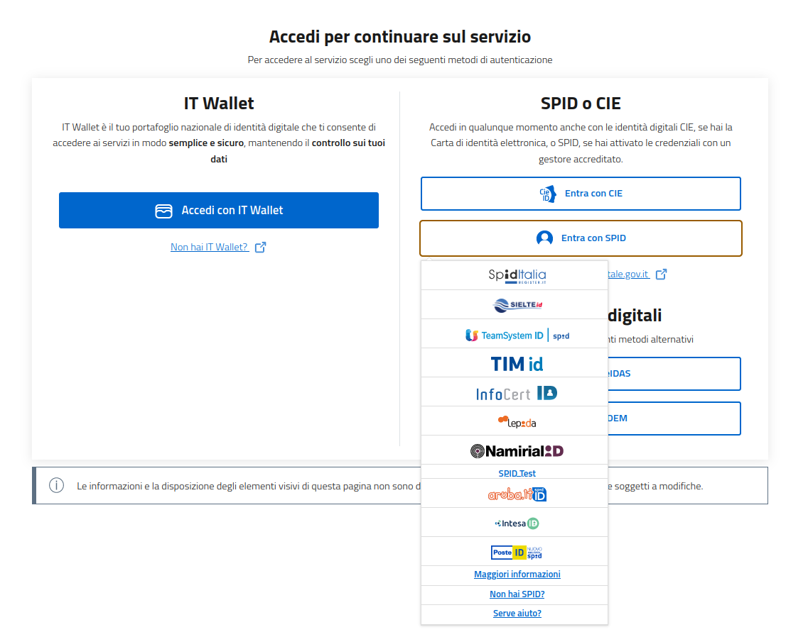
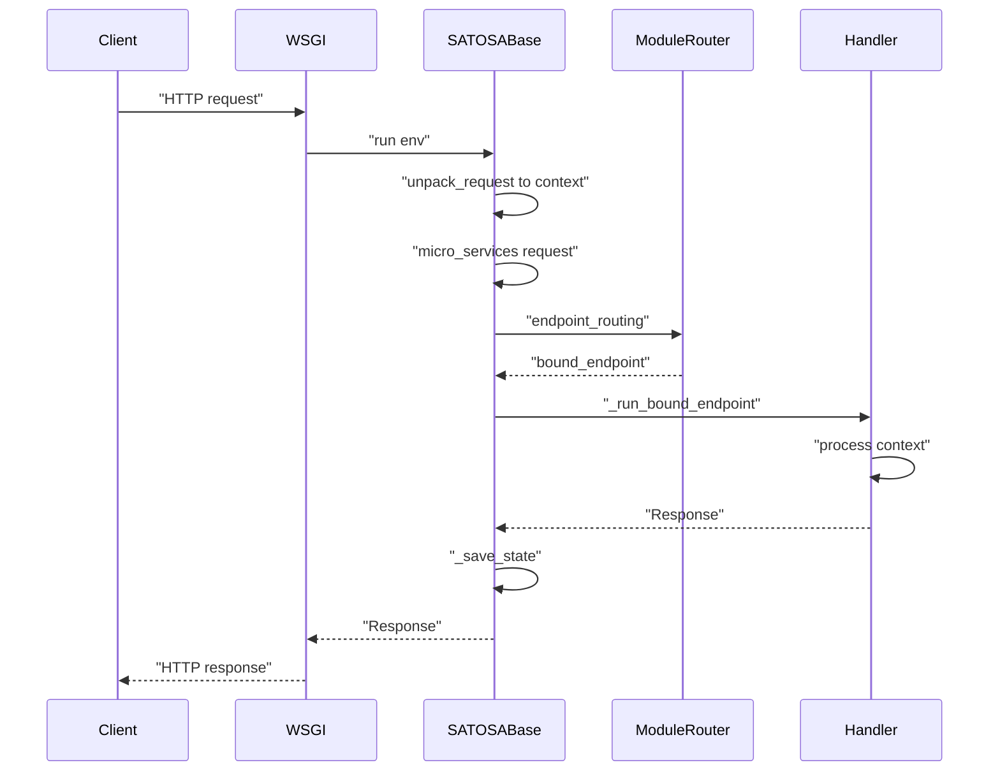
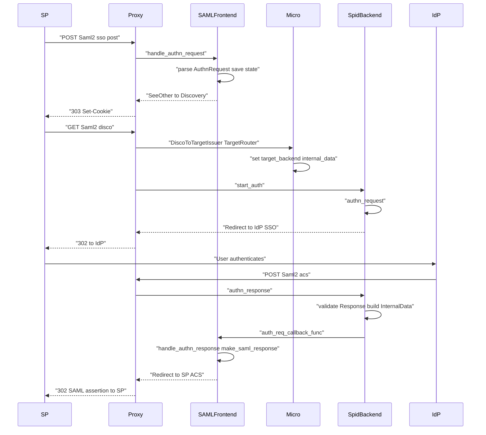
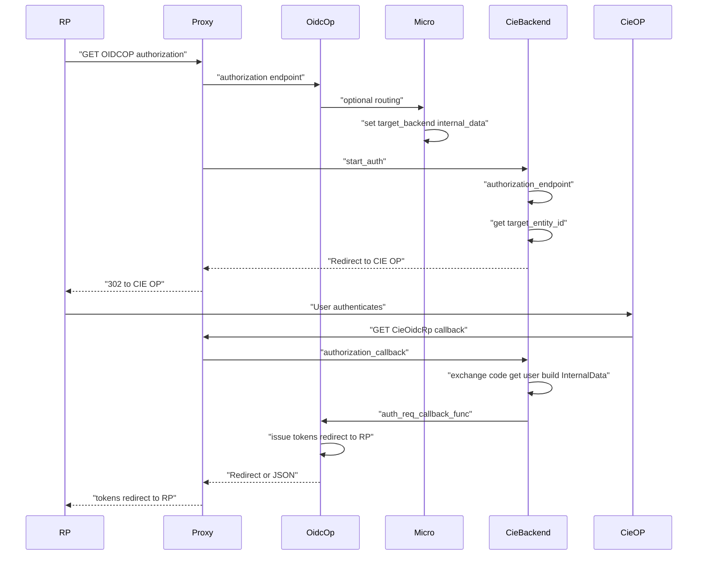
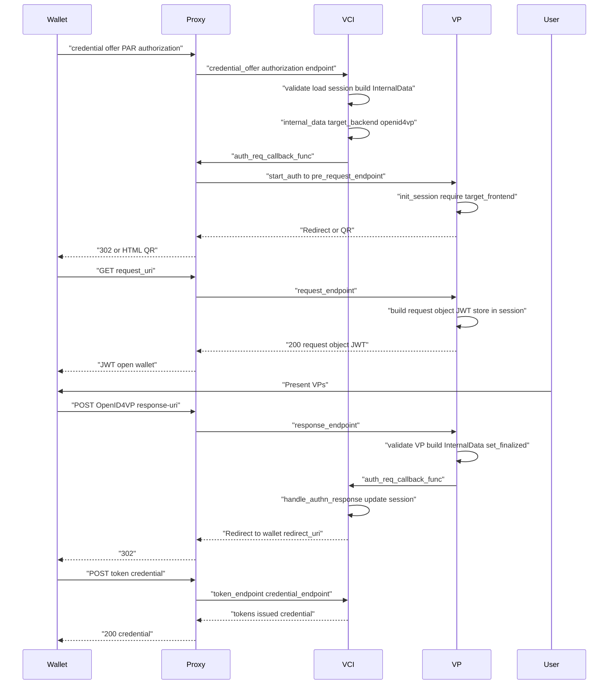
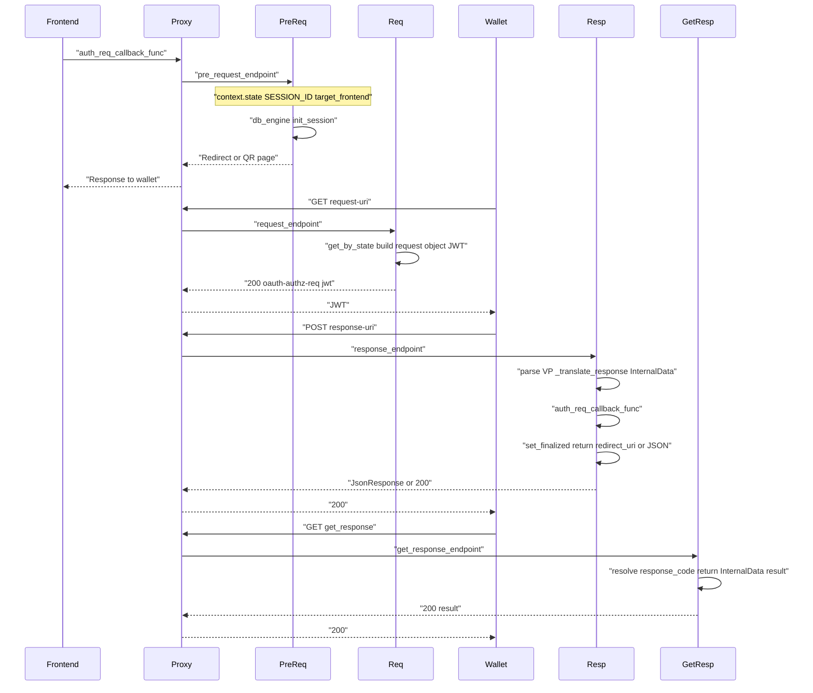

SaToSa API Dev Guide
--------------------

This document describes how the SATOSA proxy, frontends (SAML2, OIDC OP, OpenID4VCI), backends (spidsaml2, ciesaml2, CieOidc, pyeudiw OpenID4VP), and microservices integrate. It focuses on the **context object**, **call sequence**, **example I/O**, and **sequence diagrams** to help developers understand the internal API and plugin I/O.

## Requests, Context, Responses

Every HttpRequest is parsed by `proxy_Server.unpack_request` in the call()
method of `proxy_Server.WsgiApplication`, a child of base.SATOSABase.
It fills a context object with request arguments like the following:

````
{'_path': 'Saml2/sso/post',
 'cookie': 'SAML2_PROXY_STATE="_Td6WFoAAATm[...]',
 'internal_data': {},
 'request': {'RelayState': '/',
             'SAMLRequest': 'PD94bWw[....]'},
 'request_authorization': '',
 'state': {'_state_dict': {'CONSENT': {'filter': ['surname',
                                        'name',
                                        'schacpersonalpersonprincipalname',
                                        'schacpersonaluniqueid',
                                        'schacpersonaluniquecode',
                                        'mail'],
                             'requester_name': [{'lang': 'en',
                                                 'text': 'http://sp1.testunical.it:8000/saml2/metadata/'}]},
                 'ROUTER': 'Saml2IDP',
                 'SATOSA_BASE': {'requester': 'http://sp1.testunical.it:8000/saml2/metadata/'},
                 'SESSION_ID': 'urn:uuid:3605176c-8079-4a5c-8ac7-8a67377f91a5',
                 'Saml2': {'relay_state': 'NChCi4Ez56y19rci'},
                 'Saml2IDP': {'relay_state': '/',
                              'resp_args': {'binding': 'urn:oasis:names:tc:SAML:2.0:bindings:HTTP-POST',
                                            'destination': 'http://sp1.testunical.it:8000/saml2/acs/',
                                            'in_response_to': 'id-0Q7q6ha9t7VbbxlZ8',
                                            'name_id_policy': '<ns0:NameIDPolicy '
                                                              'xmlns:ns0="urn:oasis:names:tc:SAML:2.0:protocol" '
                                                              'AllowCreate="false" '
                                                              'Format="urn:oasis:names:tc:SAML:2.0:nameid-format:persistent" '
                                                              '/>',
                                            'sp_entity_id': 'http://sp1.testunical.it:8000/saml2/metadata/'}}},
 'delete': False},
 'target_backend': None,
 'target_frontend': None,
 'target_micro_service': None}
````

**Hint: an authnRequest fancy print to stdout as Debug would be better inside run().

the `self.module_router.endpoint_routing(context)` is called in .run() method, returning this call
`functools.partial(<bound method SAMLFrontend.handle_authn_request of <satosa.frontends.saml2.SAMLFrontend object at 0x7ff091d733c8>>, binding_in='urn:oasis:names:tc:SAML:2.0:bindings:HTTP-POST')`
that make SATOSA find the routing to the its frontend.

````
[2019-04-14 15:42:55] [DEBUG]: [urn:uuid:3605176c-8079-4a5c-8ac7-8a67377f91a5] Routing path: Saml2/sso/post
[2019-04-14 15:42:55] [DEBUG]: [urn:uuid:3605176c-8079-4a5c-8ac7-8a67377f91a5] Found registered endpoint: module name:'Saml2IDP', endpoint: Saml2/sso/post
functools.partial(<bound method SAMLFrontend.handle_authn_request of <satosa.frontends.saml2.SAMLFrontend object at 0x7ff091d733c8>>, binding_in='urn:oasis:names:tc:SAML:2.0:bindings:HTTP-POST')
````

next `self._run_bound_endpoint(context, spec)` being called returning a
`satosa.response.SeeOther` object.

````
[2019-04-14 15:45:01] [DEBUG]: [urn:uuid:3605176c-8079-4a5c-8ac7-8a67377f91a5] Filter: ['schacpersonalpersonprincipalname', 'name', 'schacpersonaluniqueid', 'mail', 'schacpersonaluniquecode', 'surname']
[2019-04-14 15:45:01] [INFO ]: [urn:uuid:3605176c-8079-4a5c-8ac7-8a67377f91a5] Requesting provider: http://sp1.testunical.it:8000/saml2/metadata/
[2019-04-14 15:45:01] [DEBUG]: [urn:uuid:3605176c-8079-4a5c-8ac7-8a67377f91a5] Routing to backend: Saml2
````

then `self._save_state(resp, context)` and return `satosa.response.SeeOther` object.

SeeOther object is called when SATOSA redirect user-agents to DiscoFeed service, this object have the following attributes:

````
{'status': '303 See Other',
 'headers': [('Content-Type', 'text/html'),
             ('Location', 'http://sp1.testunical.it:8001/role/idp.ds?entityID=https%3A%2F%2Fsatosa.testunical.it%3A10000%2FSaml2%2Fmetadata&return=https%3A%2F%2Fsatosa.testunical.it%3A10000%2FSaml2%2Fdisco'),
             ('Set-Cookie', 'SAML2_PROXY_STATE=_Td6WF[...]; Max-Age=1200; Path=/; Secure')],
             'message': 'http://sp1.testunical.it:8001/role/idp.ds?entityID=https%3A%2F%2Fsatosa.testunical.it%3A10000%2FSaml2%2Fmetadata&return=https%3A%2F%2Fsatosa.testunical.it%3A10000%2FSaml2%2Fdisco'}
````
SeeOther object is then converted to Bytes as a standard HttpResponse (POST /Saml2/sso/post => generated 178 bytes in 1483 msecs (HTTP/1.1 303)).




*Discovery service: the user selects the authentication endpoint (IdP).*


When the response return with the selected entityID the same previous execution stack
will be called again. Now in context dictionary we found:

````
{'_path': 'Saml2/disco',
 'cookie': 'SAML2_PROXY_STATE="_Td6WFo[...]',
 'internal_data': {},
 'request': {'entityID': 'http://idp1.testunical.it:9000/idp/metadata'},
 'request_authorization': '',
 'state': None,
 'target_backend': None,
 'target_frontend': None,
 'target_micro_service': None}

````

I think that one of the most important and powerful features of SATOSA is the **microservices** pipeline.

**Disambiguation:** The term *microservices* here can be misleading. In SATOSA they are **middlewares** (plugins) that run in a chain on the proxy. They intercept requests and responses and let you inject redirects or override objects (e.g. `context`, `InternalData`) at each step. They may also integrate or call out to third‑party microservices (external services), but they are not themselves distributed microservices—they are in-process plugins executed in order by the proxy.
At this moment of the flow we have the configuration, as a constant, and a `context` with the `entityID`
expliticely defined....

````
{'_config': {'BASE': 'https://satosa.testunical.it:10000',
             'INTERNAL_ATTRIBUTES': {'attributes': {'address': {'openid': ['address.street_address'],
                                                                'orcid': ['addresses.str'],
                                                                'saml': ['postaladdress']},
                                                                'displayname': {'openid': [... ALL YOUR ATTR_MAP...]},
             'COOKIE_STATE_NAME': 'SAML2_PROXY_STATE',
             'STATE_ENCRYPTION_KEY': [...Then all the proxy_conf.yaml definitions, FRONTENDS, BACKENDS, etc...]
             [... then MICROSERVICES configured ...]

             'MICRO_SERVICES': [{'module': 'satosa.micro_services.attribute_modifications.AddStaticAttributes', 'name': 'AddAttributes', 'config': {'static_attributes': {'organisation': 'testunical', 'schachomeorganization': 'testunical.it', 'schachomeorganizationtype': 'urn:schac:homeOrganizationType:eu:higherEducationInstitution', 'organizationname': 'testunical', 'noreduorgacronym': 'EO', 'countryname': 'IT', 'friendlycountryname': 'Italy'}}},

             {'module': 'satosa.micro_services.custom_routing.DecideBackendByTarget', 'name': 'TargetRouter', 'config': {'target_mapping': {'http://idpspid.testunical.it:8088': 'spidSaml2'}}}],

             [..then logging and all the config ...]
             }}}}
````

For example in [this](https://github.com/IdentityPython/SATOSA/pull/220) PR I developed a microservice to intercept incoming request and select a custom Saml2 backend instead of the default one

---

## SATOSA request flow: call sequence and purpose

Every HTTP request is handled by the SATOSA proxy in a fixed pipeline. The sequence below applies to all frontends (SAML2, OIDC OP, OpenID4VCI); the actual endpoint and context content depend on the protocol.

### Pipeline summary

| Step | Component | Method / hook | Purpose |
|------|-----------|----------------|---------|
| 1 | `proxy_server.WsgiApplication` | `__call__(env, start_response)` | WSGI entry: build request, call `run()`. |
| 2 | `SATOSABase` | `unpack_request(env)` | Parse request into a **context**: path, cookie, query/body, headers. |
| 3 | `SATOSABase` | `run(context)` | Run microservices (request phase), then route to frontend/backend. |
| 4 | `ModuleRouter` | `endpoint_routing(context)` | Match `context._path` to a registered endpoint; return a bound callable (e.g. frontend handler). |
| 5 | `SATOSABase` | `_run_bound_endpoint(context, spec)` | Invoke the bound handler (e.g. `SAMLFrontend.handle_authn_request` or backend `start_auth`). |
| 6 | Frontend / Backend | handler `(context)` or `(context, internal_request)` | Process protocol (SAML, OIDC, OpenID4VP/4VCI), possibly set `context.target_backend`, `context.internal_data`, and return `Response`. |
| 7 | `SATOSABase` | `_save_state(resp, context)` | Persist state in cookie if response carries state (e.g. redirect). |
| 8 | — | Response returned | Convert `satosa.response.Response` to HTTP (e.g. 303, 200 + JSON). |

### Example: first request (SAML2 SSO POST)

- **In:** `POST /Saml2/sso/post` with `SAMLRequest`, `RelayState`.
- **After unpack_request:** `context._path = 'Saml2/sso/post'`, `context.request = {'SAMLRequest': '...', 'RelayState': '/'}`, `context.state` from cookie or empty.
- **After endpoint_routing:** bound callable = `SAMLFrontend.handle_authn_request(binding_in='...')`.
- **After _run_bound_endpoint:** frontend parses AuthnRequest, may run microservices (e.g. IdpHinting), then redirects to discovery; response = `SeeOther` with `Set-Cookie` for state.

### Example: discovery callback (SAML2)

- **In:** `GET /Saml2/disco?entityID=<idp_entity_id>` (and cookie with state).
- **After unpack_request:** `context._path = 'Saml2/disco'`, `context.request` / `context.qs_params` with `entityID`, `context.state` from cookie (contains frontend/ROUTER etc.).
- **Microservices:** e.g. DiscoToTargetIssuer (disco) → TargetRouter sets `context.target_backend` from `entityID` (e.g. `spidSaml2`).
- **Routing:** may route to backend; backend’s `start_auth(context, internal_request)` is invoked with `internal_request` built from context (e.g. requester, relay_state). Backend (e.g. SpidSAML2) uses `context.internal_data.get("target_entity_id")` and sends user to IdP.

### Example: backend callback (SAML2)

- **In:** `POST /Saml2/acs` with `SAMLResponse`, `RelayState` (and cookie).
- **After unpack_request:** `context.request['SAMLResponse']`, `context.state[self.name]` with `relay_state`, `req_args`.
- **Bound handler:** backend’s callback (e.g. `authn_response`) validates response, builds `InternalData` (attributes, auth_info), then calls `auth_req_callback_func(context, internal_data)` → frontend’s `handle_authn_response` → redirect to SP with token/assertion.

---

## Context object: common and protocol-specific fields

`satosa.context.Context` is the single object passed through the pipeline. It is a small wrapper around a dictionary; plugins and SATOSA core read/write known keys. Below we summarize **common** attributes and then **differences** per protocol (SAML2, OIDC OP, pyeudiw OpenID4VP, pyeudiw OpenID4VCI).

### Common context attributes (all flows)

| Attribute | Set by | Purpose |
|-----------|--------|---------|
| `_path` | proxy (from request URL) | Path used for endpoint routing (e.g. `Saml2/sso/post`, `OIDCOP/authorization`, `OpenID4VCI/authorization`). |
| `request` | proxy (from body/query) | Parsed request params (e.g. `SAMLRequest`, `RelayState`, or `client_id`, `request_uri`, etc.). |
| `request_method` | proxy | `GET` or `POST`. |
| `qs_params` | proxy | Query string params (for GET or form POST). |
| `cookie` | proxy | Raw cookie header (e.g. state cookie). |
| `state` | proxy (decode) / frontend / backend | Encrypted state dict: session id, frontend/backend names, protocol-specific data (relay_state, req_args, etc.). |
| `internal_data` | microservices / frontend | Dict for internal use; e.g. `target_entity_id` (IdP/OP entity ID), or `InternalData`-like data for backend selection. |
| `target_backend` | microservices / frontend | Name of backend to use (e.g. `spidSaml2`, `OpenID4VP`, `CieOidcRp`). |
| `target_frontend` | proxy / routing | Name of frontend that started the session (e.g. `Saml2IDP`, `OIDC`, `OpenID4VCI`). |
| `http_headers` | proxy | Request headers (e.g. for Content-Type, Authorization). |

### SAML2 (frontend + spidsaml2 / ciesaml2 backend)

- **state:** Contains `ROUTER` (frontend name), `SATOSA_BASE.requester` (SP entity ID), `Saml2IDP.resp_args` (binding, destination, `in_response_to`, `sp_entity_id`), `Saml2` / backend name with `relay_state`, `req_args.id` (AuthnRequest id). After discovery, microservices set `target_backend` (e.g. `spidSaml2`).
- **internal_data:** Set by microservices; backend reads `internal_data.get("target_entity_id")` as IdP entity ID (and optionally `target_entity_id` for SSO location).
- **request:** `SAMLRequest`, `RelayState` on first POST; `SAMLResponse`, `RelayState` on callback.
- **Purpose:** Frontend parses AuthnRequest, drives discovery; backend builds AuthnRequest to IdP and, on return, validates Response and calls `auth_req_callback_func(context, internal_data)` with `InternalData` (attributes, auth_info).

### OIDC OP (satosa_oidcop frontend + CIE OIDC backend)

- **state:** Holds OIDC session (e.g. session id, client_id); managed by idpyoidc/satosa_oidcop.
- **internal_data:** Set by routing/microservices; CIE OIDC backend reads `internal_data.get("target_entity_id")` as the CIE OP URL to redirect the user to.
- **request:** Standard OIDC params (`client_id`, `redirect_uri`, `response_type`, `scope`, etc.); on callback, token endpoint params.
- **Purpose:** Frontend handles OIDC authorization and token endpoints; when a “backend” auth is needed, it sets `target_backend` and `internal_data`; CIE OIDC backend’s `start_auth` redirects to CIE OP; callback handler builds `InternalData` and calls `auth_req_callback_func(context, internal_data)`.

### pyeudiw OpenID4VP (backend only)

- **state:** Must contain `SESSION_ID` (from the frontend that started the flow, e.g. OpenID4VCI). Used to bind the VP flow to the same SATOSA session.
- **internal_data:** Not used the same way as SAML2/OIDC; backend stores session in its own DB (e.g. MongoDB) keyed by `state` (VP request state) and `session_id`.
- **request:** POST body can contain wallet metadata (e.g. for request endpoint); response endpoint receives form-urlencoded authorization response (e.g. `vp_token`, `presentation_submission`, state).
- **target_frontend:** Backend checks `context.target_frontend` to ensure the request comes from a known frontend (e.g. OpenID4VCI) before creating a VP session.
- **Purpose:** Backend implements OpenID4VP: pre_request (init session, return request_uri / QR), request (return request object JWT), response (receive VP, build `InternalData`, call `auth_req_callback_func`), get_response (return auth result to wallet). No SAML/OIDC `internal_data.target_entity_id`; “verifier” is the proxy itself.

### pyeudiw OpenID4VCI (frontend only)

- **state:** Holds SATOSA `SESSION_ID`; OpenID4VCI frontend also keeps its own session in DB (e.g. by `session_id`, `request_uri_part`).
- **internal_data:** Frontend builds `InternalData(requester=client_id, subject_type=..., requester_name=...)` and sets `context.internal_data = internal_req` before calling `auth_req_callback_func(context, internal_req)` to start the backend (e.g. OpenID4VP).
- **target_backend:** Frontend sets `context.target_backend` (e.g. `openid4vp` or from config `default_target_authentication_backend`).
- **request:** Credential offer, PAR, authorization (request_uri, client_id, etc.), token, credential requests — each mapped to different endpoints; body/query vary per endpoint.
- **Purpose:** Frontend implements OpenID4VCI (credential issuer); when the wallet must authenticate (e.g. present VPs), it invokes the backend via `auth_req_callback_func`; when backend calls back with `InternalData`, frontend’s `handle_authn_response` updates session and redirects wallet (e.g. with auth code or tokens).

---

## Example context objects by protocol

### SAML2 – after unpack_request (SSO POST)

```python
{
    "_path": "Saml2/sso/post",
    "cookie": "SAML2_PROXY_STATE=\"_Td6WFoAAATm[...]\"",
    "internal_data": {},
    "request": {"RelayState": "/", "SAMLRequest": "PD94bWw[....]"},
    "request_authorization": "",
    "state": {
        "_state_dict": {
            "CONSENT": {"filter": ["surname", "name", ...], "requester_name": [...]},
            "ROUTER": "Saml2IDP",
            "SATOSA_BASE": {"requester": "http://sp1.testunical.it:8000/saml2/metadata/"},
            "SESSION_ID": "urn:uuid:3605176c-8079-4a5c-8ac7-8a67377f91a5",
            "Saml2": {"relay_state": "NChCi4Ez56y19rci"},
            "Saml2IDP": {"relay_state": "/", "resp_args": {"binding": "...", "destination": "...", "in_response_to": "id-0Q7q6ha9t7VbbxlZ8", "sp_entity_id": "..."}}
        },
        "delete": False
    },
    "target_backend": None,
    "target_frontend": None,
    "target_micro_service": None
}
```

### SAML2 – discovery callback (before backend)

```python
{
    "_path": "Saml2/disco",
    "request": {"entityID": "http://idp1.testunical.it:9000/idp/metadata"},
    "state": {...},  # from cookie, same session
    "target_backend": "spidSaml2",   # set by microservice
    "internal_data": {"target_entity_id": "http://idp1.testunical.it:9000/idp/metadata"}
}
```

### OIDC OP – authorization request (frontend)

Context is consumed by satosa_oidcop; `request` holds OIDC params. When backend is involved, `target_backend` and `internal_data["target_entity_id"]` are set (e.g. by routing) to the CIE OP URL.

### pyeudiw OpenID4VCI – authorization endpoint (before backend call)

```python
{
    "_path": "OpenID4VCI/authorization",
    "request_method": "POST",
    "request": {"request_uri": "openid4vci://...", "client_id": "..."},
    "state": {"SESSION_ID": "urn:uuid:..."},
    "internal_data": InternalData(requester=vci_entity.client_id, subject_type="pairwise", requester_name=None),
    "target_backend": "openid4vp"
}
```

### pyeudiw OpenID4VP – pre_request / request / response

- **pre_request:** `context.state["SESSION_ID"]` required; `context.target_frontend` must be set. Backend creates session in DB, returns request_uri (or QR).
- **request:** `context.state["SESSION_ID"]` or `context.qs_params["id"]` (state); `context.request` may contain wallet metadata. Backend returns signed request object JWT.
- **response:** `context.request` (form) contains `vp_token`, `presentation_submission`, state. Backend loads session by state, validates VP, builds `InternalData`, calls `auth_req_callback_func(context, internal_data)`.

---

## Mermaid sequence diagrams

### 1. Generic SATOSA request flow




---

### 2. SAML2 / SPID flow (frontend → discovery → backend → IdP → ACS)



---

### 3. OIDC OP + CIE OIDC backend flow



---

### 4. OpenID4VCI → OpenID4VP (credential issuance with VP authentication)



---

### 5. OpenID4VP backend internal (pre_request → request → response → get_response)



---

## How to write a backend and a frontend

This section describes the **required methods and integration contract** for SATOSA backends and frontends, with minimal examples. Backends talk to identity providers (IdPs) or other auth sources; frontends talk to relying parties (RPs/SPs). The proxy wires them via `context`, `auth_req_callback_func` / `auth_req_callback_func`, and routing (`target_backend` / `target_frontend`).

### Backend: required interface

A **backend** implements the protocol toward the IdP (or equivalent). SATOSA calls it when a frontend has decided that authentication must be performed by this backend (e.g. after discovery or routing).

#### Base class and constructor

- **Base class:** `satosa.backends.base.BackendModule`
- **Constructor** (you must call `super().__init__(...)`):

```python
def __init__(self, auth_callback_func, internal_attributes, base_url, name):
```

| Argument | Purpose |
|----------|---------|
| `auth_callback_func` | `(context, internal_data) -> Response`. Call this **when the backend has finished authentication** to hand control back to the frontend with user attributes and auth info. |
| `internal_attributes` | Dict mapping internal attribute names to IdP/OP and SP/RP names; used by `self.converter` (AttributeMapper) to translate attributes. |
| `base_url` | Base URL of the proxy (e.g. `https://proxy.example.org`). |
| `name` | Backend name (e.g. `spidSaml2`, `OpenID4VP`). Used in URLs and in `context.state`. |

After `super().__init__`, the base class sets:
- `self.auth_callback_func` — callback to invoke when auth is done.
- `self.converter` — `AttributeMapper(internal_attributes)` to convert IdP attributes to internal and then to frontend format.

#### Required methods

| Method | Purpose | Return value |
|--------|---------|--------------|
| **`register_endpoints(self, **kwargs)`** | Register URL path → handler. SATOSA uses this to route requests (e.g. `{name}/sso`, `{name}/acs`, `{name}/request-uri`). | **List of tuples** `(path, callable)`. `path` is a string like `"MyBackend/authorization"` (often `f"{self.name}/{suffix}"`). `callable` must accept one argument, `context`, and return a `satosa.response.Response` (or subclass). |
| **`start_auth(self, context, internal_request)`** | Entry point when the proxy has chosen this backend to perform authentication. Use `context` (and optionally `internal_request`) to start the auth flow (e.g. redirect to IdP or return a request_uri / QR). | **`satosa.response.Response`** — e.g. `Redirect`, `SeeOther`, or `Response(...)`. |

#### Optional method (metadata)

| Method | Purpose |
|--------|---------|
| **`get_metadata_desc(self)`** | Return a description used when generating **frontend** metadata (e.g. SAML SP metadata). Required for some frontends; OAuth/OIDC backends can use a helper like `get_metadata_desc_for_oauth_backend`. |

#### Backend flow in short

1. **Routing:** A microservice or the frontend sets `context.target_backend` to your backend `name`. SATOSA then calls your backend’s `start_auth(context, internal_request)`.
2. **Start auth:** In `start_auth`, read `context.state`, `context.internal_data` (e.g. `target_entity_id`), and optionally `internal_request` (requester, etc.). Send the user to the IdP (redirect) or return a response that lets the client (e.g. wallet) continue the flow.
3. **Callback URL:** Your backend registers one or more endpoints (e.g. ACS, token callback, response-uri). When the IdP/client calls that URL, SATOSA invokes the callable you registered for that path with `context`.
4. **Finish auth:** In that callable, validate the response, build `InternalData` (attributes, `auth_info`, subject, etc.), then call **`self.auth_callback_func(context, internal_data)`**. That returns the final `Response` (e.g. redirect to SP). Do not forget to call the callback so the frontend can send the response to the RP.

#### Minimal backend example (skeleton)

```python
from satosa.backends.base import BackendModule
from satosa.context import Context
from satosa.internal import InternalData, AuthenticationInformation
from satosa.response import Response, Redirect

class MyBackend(BackendModule):
    def __init__(self, auth_callback_func, internal_attributes, base_url, name):
        super().__init__(auth_callback_func, internal_attributes, base_url, name)
        self.config = {}  # load from module_config in real impl

    def register_endpoints(self, **kwargs):
        # Each tuple: (path, callable). Callable(context) -> Response.
        return [
            (f"{self.name}/authorization", self._authorization),
            (f"{self.name}/callback", self._callback),
        ]

    def start_auth(self, context: Context, internal_request):
        # Called when proxy selects this backend. Redirect to IdP or return first step.
        entity_id = context.internal_data.get("target_entity_id", "https://idp.example.org")
        # ... build redirect to IdP ...
        return Redirect("https://idp.example.org/sso?...")

    def _authorization(self, context: Context) -> Response:
        # Optional: if start_auth delegates to an endpoint.
        return self.start_auth(context, None)

    def _callback(self, context: Context) -> Response:
        # IdP called this URL. Parse response, build InternalData, call frontend.
        # user_attrs = ...
        auth_info = AuthenticationInformation("urn:oasis:names:tc:SAML:2.0:ac:classes:Password", "2020-01-01T00:00:00Z", entity_id)
        internal_data = InternalData(auth_info=auth_info, attributes=user_attrs)
        return self.auth_callback_func(context, internal_data)
```

---

### Frontend: required interface

A **frontend** implements the protocol toward the RP/SP (or wallet). It receives the first request from the client, may run discovery/routing, then calls a backend via `auth_req_callback_func`; when the backend finishes, SATOSA calls the frontend’s `handle_authn_response`.

#### Base class and constructor

- **Base class:** `satosa.frontends.base.FrontendModule`
- **Constructor** (call `super().__init__(...)`):

```python
def __init__(self, auth_req_callback_func, internal_attributes, base_url, name):
```

| Argument | Purpose |
|----------|---------|
| `auth_req_callback_func` | `(context, internal_request) -> Response`. Call this to **start backend authentication**: the proxy will route to the backend indicated by `context.target_backend` and call its `start_auth(context, internal_request)`. |
| `internal_attributes` | Same as for backend; used by `self.converter`. |
| `base_url` | Base URL of the proxy. |
| `name` | Frontend name (e.g. `Saml2IDP`, `OpenID4VCI`). |

The base sets `self.auth_req_callback_func` and `self.converter`.

#### Required methods

| Method | Purpose | Return value |
|--------|---------|--------------|
| **`register_endpoints(self, backend_names, **kwargs)`** | Register URL path → handler for **frontend** endpoints (e.g. SSO, discovery, authorization, token). | **List of tuples** `(path, callable)`. `path` is a string (e.g. `f"{self.name}/sso/post"`, `f"{self.name}/authorization"`). `callable(context)` must return `satosa.response.Response`. |
| **`handle_authn_response(self, context, internal_resp)`** | Called by SATOSA **when the backend has completed authentication**. Use `internal_resp` (InternalData: attributes, auth_info) to build the response to the client (e.g. SAML response, redirect with code, or JSON). | **`satosa.response.Response`** — what the client (RP/SP/wallet) should receive. |
| **`handle_backend_error(self, exception)`** | Called when the backend raises (e.g. `SATOSAAuthenticationError`). Return a suitable error response to the client. | **`satosa.response.Response`**. |

#### Frontend flow in short

1. **First request:** Client hits a frontend URL (e.g. `/Saml2/sso/post`, `/OpenID4VCI/authorization`). The handler registered for that path runs with `context`. It may redirect to discovery or build an `InternalData` and set `context.target_backend`, then call **`self.auth_req_callback_func(context, internal_request)`** to start the backend.
2. **Backend runs:** The proxy calls the chosen backend’s `start_auth` and later the backend’s callback URL handler. When the backend finishes, it calls `auth_callback_func(context, internal_data)`.
3. **Frontend finishes:** SATOSA then calls your **`handle_authn_response(context, internal_resp)`**. You use `internal_resp.attributes` and `internal_resp.auth_info` to send the final response to the client (redirect, JSON, etc.).

#### Invoking the backend from the frontend

Before calling `auth_req_callback_func`, the frontend must set:

- **`context.target_backend`** — name of the backend (e.g. `"spidSaml2"`, `"OpenID4VP"`).
- **`context.internal_data`** — either a dict (e.g. `{"target_entity_id": idp_entity_id}`) or an `InternalData` instance with at least `requester` (and optionally `requester_name`, `subject_type`) so the backend knows who is requesting.

Then call:

```python
internal_request = InternalData(requester=client_id, requester_name=..., subject_type="pairwise")
context.internal_data = internal_request  # if backend expects dict, set dict instead
context.target_backend = "MyBackend"
return self.auth_req_callback_func(context, internal_request)
```

#### Minimal frontend example (skeleton)

```python
from satosa.frontends.base import FrontendModule
from satosa.context import Context
from satosa.internal import InternalData
from satosa.response import Response, Redirect

class MyFrontend(FrontendModule):
    def __init__(self, auth_req_callback_func, internal_attributes, base_url, name):
        super().__init__(auth_req_callback_func, internal_attributes, base_url, name)

    def register_endpoints(self, backend_names, **kwargs):
        # Expose frontend endpoints; each callable(context) -> Response.
        return [
            (f"{self.name}/auth", self._auth),
        ]

    def _auth(self, context: Context) -> Response:
        # Client hit /MyFrontend/auth. Decide backend and start auth.
        context.target_backend = "MyBackend"
        context.internal_data = {"target_entity_id": "https://idp.example.org"}
        internal_request = InternalData(requester=context.request.get("client_id"))
        return self.auth_req_callback_func(context, internal_request)

    def handle_authn_response(self, context: Context, internal_resp: InternalData) -> Response:
        # Backend finished; send response to client (RP).
        # Build redirect or JSON from internal_resp.attributes and internal_resp.auth_info.
        return Redirect(f"{context.request.get('redirect_uri')}?code=...")

    def handle_backend_error(self, exception) -> Response:
        return Response(status="403", message=str(exception))
```

---

### Endpoint handler contract

Handlers registered in `register_endpoints` (both backend and frontend) must:

- Accept **one argument:** `context` (`satosa.context.Context`).
- Return a **`satosa.response.Response`** (or subclass: `Redirect`, `SeeOther`, `JsonResponse`, etc.).

Optional: accept a second argument or keyword args if your framework passes them (e.g. some SATOSA versions or custom loaders). The minimal contract is `(context) -> Response`.

```python
def my_endpoint(self, context: Context) -> Response:
    # Read: context.request, context.state, context.request_method, context.qs_params, etc.
    # Write: context.state (via state cookie), context.internal_data, context.target_backend (frontend only).
    return Response(status="200", message="...")
```

---

### Configuration (YAML) and registration

- **Backend:** Add your module to `BACKEND_MODULES` in `proxy_conf.yaml`, and point to a YAML that defines `module` (full dotted path to the class) and `name`:

```yaml
# conf/backends/my_backend.yaml
module: mypackage.backends.my_backend.MyBackend
name: MyBackend
config:
  # ... your config ...
```

- **Frontend:** Add to `FRONTEND_MODULES` and use a YAML with `module` and `name`:

```yaml
# conf/frontends/my_frontend.yaml
module: mypackage.frontends.my_frontend.MyFrontend
name: MyFrontend
config:
  # ...
```

Ensure the package path is on `CUSTOM_PLUGIN_MODULE_PATHS` (or installed) so SATOSA can import the class.

---

## Request microservices

**Request microservices** run **after** a frontend has processed an incoming auth request and called `auth_req_callback_func(context, internal_request)`, and **before** the proxy selects a backend and calls `backend.start_auth()`. They form a chain: each microservice can read and modify `context` and `internal_request`, then call the next in chain. The last link in the chain is the proxy’s `_auth_req_finish`, which does backend routing and starts the backend.

### When they run

1. Client hits a frontend endpoint (e.g. SAML SSO, OIDC authorization, OpenID4VCI authorization).
2. Frontend builds `InternalData` (requester, etc.), sets `context.target_backend` and/or `context.internal_data` (or decorations), and calls **`auth_req_callback_func(context, internal_request)`**.
3. The proxy runs **all request microservices in order**: `request_micro_services[0].process(context, internal_request)` → … → last microservice → `_auth_req_finish(context, internal_request)`.
4. `_auth_req_finish` resolves the backend from `context.target_backend` and calls `backend.start_auth(context, internal_request)`.

So request microservices see the **internal request** (requester, etc.) and the **context** (state, path, request, decorations). They are the right place to set or change **backend selection** and **target entity** (e.g. IdP/OP) based on query params, state, or config.

### Base class and constructor

- **Base class:** `satosa.micro_services.base.RequestMicroService` (subclass of `MicroService`).
- **Constructor:** The loader instantiates with `(internal_attributes=..., config=..., name=..., base_url=...)`. Your `__init__` must accept these and call `super().__init__(*args, **kwargs)`.

### Required method: `process(self, context, data)`

| Signature | Purpose | Return value |
|-----------|---------|--------------|
| **`process(self, context, data)`** | Inspect and/or modify `context` and `data` (the `InternalData` request), then pass control to the next link in the chain. | Return **`self.next(context, data)`** (or the modified `context`/`data`). The last link’s `next` is `_auth_req_finish`, which returns a `Response`. |

- **`context`:** `satosa.context.Context` — request state, path, `context.request`, `context.state`, `context.qs_params`, and **decorations** (e.g. `context.get_decoration(Context.KEY_TARGET_ENTITYID)`, `context.decorate(Context.KEY_TARGET_ENTITYID, entity_id)`).
- **`data`:** `satosa.internal.InternalData` — the internal request (e.g. `requester`, `requester_name`, `subject_type`). Can be modified in place (e.g. add data for the backend).

You **must** call `return self.next(context, data)` (or the next callable with the same signature) so the chain continues.

### Optional: `register_endpoints(self)`

If the microservice must handle **extra URL paths** (e.g. a discovery callback), implement:

```python
def register_endpoints(self):
    return [(path_or_regex, self._handler), ...]
```

Each handler is **`(context) -> Response`**. The proxy registers these paths; when one is hit, your handler runs. To continue the auth flow from that handler (e.g. after discovery), restore state from `context.state[self.name]`, set `context.target_backend` and/or decorations, build or restore `InternalData`, and call **`self.next(context, data)`** so the rest of the request chain (and then the backend) runs.

### Example: IdpHinting (set target entity from query param)

```python
from satosa.micro_services.base import RequestMicroService
from satosa.context import Context

class IdpHinting(RequestMicroService):
    def __init__(self, config, *args, **kwargs):
        super().__init__(*args, **kwargs)
        self.idp_hint_param_names = config["allowed_params"]  # e.g. ["idp_hint", "entityID"]

    def process(self, context, data):
        target_entity_id = context.get_decoration(Context.KEY_TARGET_ENTITYID)
        if target_entity_id or not context.qs_params:
            return self.next(context, data)
        for param_name in self.idp_hint_param_names:
            if param_name in context.qs_params:
                context.decorate(Context.KEY_TARGET_ENTITYID, context.qs_params[param_name])
                break
        return self.next(context, data)
```

### Example: DecideBackendByTargetIssuer (set target backend from target entity)

```python
from satosa.micro_services.base import RequestMicroService
from satosa.context import Context
from satosa.internal import InternalData

class DecideBackendByTargetIssuer(RequestMicroService):
    def __init__(self, config, *args, **kwargs):
        super().__init__(*args, **kwargs)
        self.target_mapping = config["target_mapping"]   # entity_id -> backend name
        self.default_backend = config["default_backend"]

    def process(self, context: Context, data: InternalData):
        target_issuer = context.get_decoration(Context.KEY_TARGET_ENTITYID)
        if not target_issuer:
            return self.next(context, data)
        context.target_backend = (
            self.target_mapping.get(target_issuer) or self.default_backend
        )
        return self.next(context, data)
```

### Example: DiscoToTargetIssuer (disco callback + state restore)

Runs when the user returns from a discovery page with `entityID`. It stores state before redirecting to discovery and restores it when the disco endpoint is called:

```python
# In process(): save target_frontend and internal_data into context.state[self.name]
# so the disco callback can restore them.
def process(self, context: Context, data: InternalData):
    context.state[self.name] = {
        "target_frontend": context.target_frontend,
        "internal_data": data.to_dict(),
    }
    return self.next(context, data)

# register_endpoints(): register the disco path (e.g. ".*/disco").
def register_endpoints(self):
    return [(path, self._handle_disco_response) for path in self.disco_endpoints]

# When user returns from discovery:
def _handle_disco_response(self, context: Context):
    target_issuer = context.request.get("entityID")
    target_frontend = context.state.get(self.name, {}).get("target_frontend")
    data_serialized = context.state.get(self.name, {}).get("internal_data", {})
    data = InternalData.from_dict(data_serialized)
    context.target_frontend = target_frontend
    context.decorate(Context.KEY_TARGET_ENTITYID, target_issuer)
    return self.next(context, data)
```

### Configuration (YAML)

Request microservices are listed in the **same** `MICRO_SERVICES` list in `proxy_conf.yaml`. The loader keeps only classes that are subclasses of **`RequestMicroService`**:

```yaml
# conf/microservices/my_request_microservice.yaml
module: mypackage.micro_services.my_module.MyRequestMicroService
name: MyRequestMicroService
config:
  allowed_params: [idp_hint, entityID]
```

Order in `MICRO_SERVICES` defines the chain (e.g. IdpHinting → DiscoToTargetIssuer → DecideBackendByTargetIssuer).

---

## Response microservices

**Response microservices** run **after** a backend has finished authentication and called `auth_callback_func(context, internal_data)`, and **before** the proxy calls the frontend’s `handle_authn_response()`. They form a chain: each microservice can read and modify `context` and the **internal response** (attributes, auth_info, subject_id), then call the next. The last link is the proxy’s `_auth_resp_finish`, which calls `frontend.handle_authn_response(context, internal_response)`.

### When they run

1. Backend validates the IdP/OP response, builds `InternalData` (attributes, auth_info, subject_id, requester), and calls **`auth_callback_func(context, internal_data)`**.
2. The proxy runs **all response microservices in order**: `response_micro_services[0].process(context, internal_response)` → … → last microservice → `_auth_resp_finish(context, internal_response)`.
3. `_auth_resp_finish` finds the frontend from context and calls `frontend.handle_authn_response(context, internal_response)`.

So response microservices see the **internal response** (user attributes, auth_info, subject_id) and the **context**. They are the right place to add, remove, or transform **attributes** (e.g. add static attributes, filter by regex, hash values) before the frontend sends the response to the RP/SP.

### Base class and constructor

- **Base class:** `satosa.micro_services.base.ResponseMicroService` (subclass of `MicroService`).
- **Constructor:** Same as request microservices: `(internal_attributes=..., config=..., name=..., base_url=...)`; call `super().__init__(*args, **kwargs)`.

### Required method: `process(self, context, data)`

| Signature | Purpose | Return value |
|-----------|---------|--------------|
| **`process(self, context, data)`** | Inspect and/or modify `context` and `data` (the `InternalData` response: attributes, auth_info, subject_id, requester), then pass control to the next link. | Return **`self.next(context, data)`**. The last link’s `next` is `_auth_resp_finish`, which returns the frontend’s `Response`. |

- **`context`:** `satosa.context.Context` — same as elsewhere; useful for metadata store, requester, etc.
- **`data`:** `satosa.internal.InternalData` — the internal **response**: `data.attributes` (dict of attribute name → list of values), `data.auth_info`, `data.subject_id`, `data.requester`. You can modify `data` in place (e.g. `data.attributes.update(...)`).

You **must** call `return self.next(context, data)` so the chain continues.

### Example: AddStaticAttributes

```python
from satosa.micro_services.base import ResponseMicroService

class AddStaticAttributes(ResponseMicroService):
    def __init__(self, config, *args, **kwargs):
        super().__init__(*args, **kwargs)
        self.static_attributes = config["static_attributes"]

    def process(self, context, data):
        data.attributes.update(self.static_attributes)
        return self.next(context, data)
```

Config:

```yaml
module: satosa.micro_services.attribute_modifications.AddStaticAttributes
name: AddStaticAttributes
config:
  static_attributes:
    organisation: "MyOrg"
    countryname: "IT"
```

### Example: Hasher (hash attribute values)

Response microservices can implement more complex logic (e.g. hash certain attributes for privacy). The built-in `Hasher` uses config to decide which attributes to hash and how. Conceptually:

```python
def process(self, context, data):
    for attr_name, values in list(data.attributes.items()):
        if attr_name in self.attributes_to_hash:
            data.attributes[attr_name] = [self._hash(v) for v in values]
    return self.next(context, data)
```

### Configuration (YAML)

Response microservices use the **same** `MICRO_SERVICES` list in `proxy_conf.yaml`. The loader keeps only classes that are subclasses of **`ResponseMicroService`**:

```yaml
# conf/microservices/my_response_microservice.yaml
module: mypackage.micro_services.my_module.AddStaticAttributes
name: AddStaticAttributes
config:
  static_attributes:
    department: "IT"
```

Order in `MICRO_SERVICES` defines the response chain. A given YAML module is either a request or a response microservice (one class = one type), but you can have both request and response microservices in the same list; each is loaded into the appropriate chain.

---

## Summary table: context usage by component

| Component | Reads context | Writes context | Key I/O |
|-----------|----------------|----------------|---------|
| **SAML2 frontend** | `_path`, `request`, `state` | `state` (via cookie), redirect | AuthnRequest in; redirect to disco/ACS out. |
| **spidsaml2 / ciesaml2** | `state`, `internal_data.target_entity_id`, `request` | `state[self.name]`, `req_args` | IdP entity ID in; InternalData out to callback. |
| **OIDC OP frontend** | `_path`, `request`, `state` | `state`, OIDC session | OIDC params in; tokens/redirect out. |
| **CieOidc backend** | `internal_data.target_entity_id` | — | CIE OP URL in; InternalData out to callback. |
| **OpenID4VCI frontend** | `request`, `state`, session DB | `internal_data`, `target_backend`, session DB | InternalData + target_backend to backend; handle_authn_response(internal_resp). |
| **OpenID4VP backend** | `state.SESSION_ID`, `target_frontend`, `request`, `qs_params` | Session DB (state, nonce, request object, response) | request_uri / JWT out; VP in; InternalData to auth_req_callback_func. |
| **Request microservices** | `context`, `data` (InternalData request), decorations, `qs_params` | `context.target_backend`, `context.decorate(KEY_TARGET_ENTITYID)`, `context.state[self.name]` | Run after frontend, before backend; set backend and target entity. |
| **Response microservices** | `context`, `data` (InternalData response: attributes, auth_info) | `data.attributes`, `data.auth_info` (in place) | Run after backend, before frontend; add/filter/transform attributes. |

