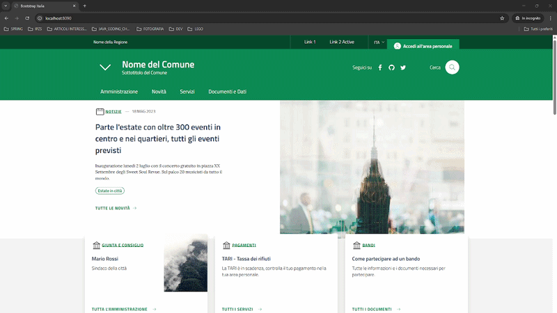

# OIDC Relying Party Demo

Lightweight standalone OIDC Relying Party for testing the **satosa-oidcop** frontend: **authorization code flow** and **PKCE (S256)**. No dependency on idpyoidc/jwtconnect; uses only FastAPI and httpx.

**The demo RP is NOT usable and is NOT recommended for PRODUCTION environments.**

The demo is available in [oidc_rp](../iam-proxy-italia-project-demo-examples/oidc_rp). The client is pre-registered in MongoDB (see [mongodb.md](mongodb.md)).

## Install (standalone)

```bash
cd iam-proxy-italia-project-demo-examples/oidc_rp
python3 -m venv .venv
source .venv/bin/activate  # or .venv\Scripts\activate on Windows
pip install -r requirements.txt
```

## Configure

```bash
cp .env.example .env
# Edit .env: set WELL_KNOW_OPENID_CONFIGURATION to your satosa-oidcop discovery URL
# (e.g. https://iam-proxy-italia.example.org/.well-known/openid-configuration)
# URL_CALLBACK must match the redirect_uri stored in MongoDB for client_id jbxedfmfyc
# (default http://localhost:8090/authz_cb/satosa)
```

## Run (standalone)

```bash
uvicorn main:app --reload --host 0.0.0.0 --port 8090
# or: python main.py  (uses PORT=8090 by default)
```

Then open **http://localhost:8090** and click **login**. You will be sent to the satosa-oidcop frontend; after authentication you are redirected back with tokens in cookies.

## Docker Compose

### Build and run

To run the RP with Docker Compose:

```bash
./run-docker-compose.sh
```

The script builds the image (see [oidc_rp.Dockerfile](../iam-proxy-italia-project-demo-examples/oidc_rp/oidc_rp.Dockerfile)) and runs the RP inside a container on the **iam-proxy-italia** network.

### Configuration

Configure the following in [docker-compose.yml](../Docker-compose/docker-compose.yml):

```yaml
WELL_KNOW_OPENID_CONFIGURATION: "${WELL_KNOW_OPENID_CONFIGURATION}"
```

### Simulation

Open your browser at **http://localhost:8090**.



## Environment variables

Both `relying-party-demo` and `relying-party-demo-mongo` use the same `OIDC_RP_DEMO_*` variables so the test client in MongoDB matches the RP configuration.

### Overview

| Variable | Description | Default |
|----------|-------------|---------|
| `OIDC_RP_DEMO_CLIENT_ID` | OIDC client identifier | `jbxedfmfyc` |
| `OIDC_RP_DEMO_CLIENT_SECRET` | Client secret for token endpoint auth | `19cc69b70d0108f630e52f72f7a3bd37ba4e11678ad1a7434e9818e1` |
| `OIDC_RP_DEMO_REDIRECT_URI` | Redirect URI (auth callback) | `http://${DEMO_RELYING_PARTY_FQDN:-localhost:8090}/authz_cb/satosa` |
| `OIDC_RP_DEMO_POST_LOGOUT_REDIRECT_URI` | Post-logout redirect URI | `https://${DEMO_RELYING_PARTY_FQDN:-localhost:8090}/session_logout/satosa` |
| `OIDC_RP_DEMO_OP_BASE_URL` | OP base URL for `registration_client_uri` | `https://${SATOSA_HOSTNAME:-iam-proxy-italia.example.org}` |
| `OIDC_RP_DEMO_CLIENT_NAME` | Human-readable client name | `ciro` |
| `OIDC_RP_DEMO_CLIENT_SALT` | Client salt (pairwise subject) | `6flfsj0Z` |
| `OIDC_RP_DEMO_REGISTRATION_ACCESS_TOKEN` | Bearer token for registration read endpoint | `z3PCMmC1HZ1QmXeXGOQMJpWQNQynM4xY` |
| `OIDC_RP_DEMO_CLIENT_ID_ISSUED_AT` | Unix timestamp when `client_id` was issued | `1630952311.410208` |
| `OIDC_RP_DEMO_CLIENT_SECRET_EXPIRES_AT` | Unix timestamp when secret expires | `1802908740.410214` |
| `OIDC_RP_DEMO_CLIENT_CONTACTS` | Comma-separated contact emails | `ops@example.com` |
| `OIDC_RP_DEMO_APPLICATION_TYPE` | Application type | `web` |
| `OIDC_RP_DEMO_TOKEN_ENDPOINT_AUTH_METHOD` | Token endpoint auth method | `client_secret_basic` |
| `OIDC_RP_DEMO_RESPONSE_TYPES` | Comma-separated response types | `code` |
| `OIDC_RP_DEMO_GRANT_TYPES` | Comma-separated grant types | `authorization_code` |
| `OIDC_RP_DEMO_ALLOWED_SCOPES` | Comma-separated allowed scopes | `openid,profile,email,offline_access` |

### Override in .env

```bash
# .env
OIDC_RP_DEMO_CLIENT_ID=my-custom-client-id
OIDC_RP_DEMO_CLIENT_SECRET=my-secret
OIDC_RP_DEMO_REDIRECT_URI=http://myrp.example.org:8090/authz_cb/satosa
OIDC_RP_DEMO_OP_BASE_URL=https://my-op.example.org
```

### RP mapping

The `relying-party-demo` container maps these to the RP app env:

| OIDC_RP_DEMO_* | RP env |
|----------------|--------|
| `OIDC_RP_DEMO_CLIENT_ID` | `CLIENT_ID` |
| `OIDC_RP_DEMO_CLIENT_SECRET` | `CLIENT_SECRET` |
| `OIDC_RP_DEMO_REDIRECT_URI` | `URL_CALLBACK` (when overridden) |

### Related variables

- `DEMO_RELYING_PARTY_FQDN` — used in default redirect URIs (default: `localhost:8090`)
- `SATOSA_HOSTNAME` — used in default `OIDC_RP_DEMO_OP_BASE_URL` (default: `iam-proxy-italia.example.org`)
- `SATOSA_BASE` — fallback for `OIDC_RP_DEMO_OP_BASE_URL` when not set

## Registered client (satosa-oidcop)

The pre-seeded client in MongoDB has:

- **client_id**: `jbxedfmfyc` (configurable via `OIDC_RP_DEMO_CLIENT_ID`)
- **redirect_uri**: `http://localhost:8090/authz_cb/satosa` (configurable via `OIDC_RP_DEMO_REDIRECT_URI`)
- **token_endpoint_auth_method**: client_secret_basic
- **grant_types**: authorization_code
- **allowed_scopes**: openid, profile, email, offline_access

PKCE is supported by the OP (satosa-oidcop); this RP sends `code_challenge` / `code_verifier` in addition to the client secret.

## OIDC client registration (MongoDB)

satosa-oidcop stores OIDC RP clients in MongoDB. Storage is configured in the frontend ([oidcop_frontend.yaml](../iam-proxy-italia-project/conf/frontends/oidcop_frontend.yaml)): by default **database** `oidcop`, **collection** `client`. Client documents follow [OpenID Connect Dynamic Client Registration](https://openid.net/specs/openid-connect-registration-1_0.html) and the format used in [SATOSA-oidcop unit tests](https://github.com/UniversitaDellaCalabria/SATOSA-oidcop/blob/main/tests/test_oidcop.py).

### Client document schema

| Field | Type | Required | Description |
|-------|------|----------|-------------|
| `client_id` | string | Yes | Unique client identifier. |
| `client_secret` | string | Yes (confidential client) | Secret for token endpoint auth. |
| `redirect_uris` | array of `[uri, metadata]` | Yes | Allowed redirect URIs. Each element is `["https://rp.example/callback", {}]` (metadata object can be `{}`). |
| `response_types` | array of strings | Yes | e.g. `["code"]` for authorization code flow. |
| `grant_types` | array of strings | Yes | e.g. `["authorization_code"]`. |
| `allowed_scopes` | array of strings | Yes | e.g. `["openid", "profile", "email", "offline_access"]`. |
| `token_endpoint_auth_method` | string | Yes | e.g. `"client_secret_basic"` or `"client_secret_post"`. |
| `application_type` | string | No | e.g. `"web"`. |
| `client_name` | string | No | Human-readable name. |
| `contacts` | array of strings | No | e.g. `["ops@example.com"]`. |
| `client_salt` | string | No | Used by idpyoidc (e.g. for pairwise subject). |
| `client_id_issued_at` | number | No | Unix timestamp when `client_id` was issued. |
| `client_secret_expires_at` | number | No | Unix timestamp when secret expires (0 = no expiry). |
| `registration_access_token` | string | No | Used by Registration Read endpoint (Bearer token). |
| `registration_client_uri` | string | No | URL for registration read (e.g. `https://<op>/registration_api?client_id=<id>`). |
| `post_logout_redirect_uris` | array of `[uri, metadata]` | No | e.g. `[["https://rp.example/logout", null]]`. |

**Important:** `redirect_uris` and `post_logout_redirect_uris` are stored as **arrays of pairs** `[uri_string, metadata]`. In MongoDB use arrays of two-element arrays, e.g. `[["https://example.com/cb", {}]]`. This matches idpyoidc and the [init-mongo.sh](../Docker-compose/mongo/init-mongo.sh) seed client.

### Insert a new client (new RP)

From the project root, with Docker Compose and Mongo running in `satosa-mongo`:

```bash
docker compose exec satosa-mongo mongosh "mongodb://${MONGO_DBUSER:-satosa}:${MONGO_DBPASSWORD:-thatpassword}@localhost:27017/oidcop" --eval '
db.client.insertOne(
   {
     "client_id":"jbxedfmfyc",
     "client_name":"ciro",
     "client_salt":"6flfsj0Z",
     "registration_access_token":"z3PCMmC1HZ1QmXeXGOQMJpWQNQynM4xY",
     "registration_client_uri":"https://iam-proxy-italia.example.org/registration_api?client_id=jbxedfmfyc",
     "client_id_issued_at":1630952311.410208,
     "client_secret":"19cc69b70d0108f630e52f72f7a3bd37ba4e11678ad1a7434e9818e1",
     "client_secret_expires_at":1802908740.410214,
     "application_type":"web",
     "contacts":["ops@example.com"],
     "token_endpoint_auth_method":"client_secret_basic",
     "redirect_uris":[["http://localhost:8090/authz_cb/satosa", {}]],
     "post_logout_redirect_uris":[["https://localhost:8090/session_logout/satosa", null]],
     "response_types":["code"],
     "grant_types":["authorization_code"],
     "allowed_scopes":["openid","profile","email","offline_access"]
   }
)
'
```

Customise at least: `client_id`, `client_secret`, `redirect_uris`, and `registration_client_uri` (OP base URL + same `client_id`). Credentials come from `.env` (`MONGO_DBUSER` / `MONGO_DBPASSWORD`, default `satosa` / `thatpassword`). The OP reads clients at request time—no restart needed.

### Add a redirect URI to an existing client

To allow another callback URL for the pre-seeded client `jbxedfmfyc` (e.g. for the leplusorg debugger):

```bash
docker compose exec satosa-mongo mongosh "mongodb://${MONGO_DBUSER:-satosa}:${MONGO_DBPASSWORD:-thatpassword}@localhost:27017/oidcop" --eval 'db.client.updateOne({ client_id: "jbxedfmfyc" }, { $push: { redirect_uris: ["http://localhost:8080/login", {}] } })'
```

Use the same `[uri, metadata]` pair format as in the schema (e.g. `["<absolute_uri>", {}]`).

### Indexes (optional)

If you create the `client` and `session` collections yourself (e.g. without using [init-mongo.sh](../Docker-compose/mongo/init-mongo.sh)), create the following indexes. They are already created by the init script when using Docker Compose with the `storage_mongo` (or `oidc` / `demo`) profile.

**Client collection:**

```javascript
db.client.createIndex({ "client_id": 1 }, { unique: true });
db.client.createIndex({ "registration_access_token": 1 }, { unique: true, partialFilterExpression: { registration_access_token: { $type: "string" } } });
```

**Session collection:**

```javascript
db.session.createIndex({ "sid": 1 }, { unique: true });
db.session.createIndex(
  { "expires_at": 1 },
  { expireAfterSeconds: 0, partialFilterExpression: { count: { $gt: 2 } } }
);
```

### Troubleshooting: "Cannot find client in client DB"

The OIDCOP frontend reads clients from MongoDB. Either (1) start the stack with a profile that includes MongoDB so the seed runs, e.g. `docker compose --profile oidc up` (or `--profile demo` / `--profile storage_mongo`), or (2) the MongoDB data directory already existed before the seed was added — remove `Docker-compose/mongo/db` and restart so the init runs again, or insert the client manually as in the example above.

## Customization

### Internationalization

For internationalization, refer to: https://jinja.palletsprojects.com/en/stable/extensions/

### Templates

For configuring your own templates:

https://jinja.palletsprojects.com/en/stable/

## See also

- [mongodb.md](mongodb.md) — MongoDB installation and usage
- [SATOSA-oidcop](https://github.com/UniversitaDellaCalabria/SATOSA-oidcop) — frontend and [unit tests](https://github.com/UniversitaDellaCalabria/SATOSA-oidcop/blob/main/tests/test_oidcop.py)
- [idpyoidc client database](https://idpy-oidc.readthedocs.io/en/latest/server/contents/clients.html)
